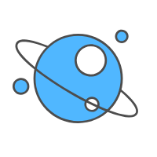

# Wormhole
f2e tools and sort out some website quick links

## Wiki
wormhole（虫洞），又名"Einstein —— Rosen Bridge"，是宇宙中可能存在的连接两个不同时空的狭窄隧道。

## Introduction

<b>Wormhole</b> 中整理了常用网站的快速链接入口，用两个层级来区分排版。其实，其中的链接多数是前端的工具和资料，如果你是一位后端开发，你也可以通过拉取我的项目，替换 data 文件中的数据，重新发布成 GitPage，就能打造你自己的工具库网站了。

项目还提供 <b><i>`npm run d`</i></b> 一条命令行发布。

希望能帮你提升效率 😊！ 

## Hope you know
 - 「快速链接」的内容尽量保持（一周一更）的频率持续更新。
 - 给我些建议吧（关于内容 & 交互），可以提在 issues 里 & 微信中告诉我，或者 PR。

## RandomColor
 - 浅葱色 #00a6ac
 - 赤橙 #f15a22
 - 青 #009ad6
 - 蓝色 #145b7d
 - 山鸠色 #525f42
 - 亜麻色 #b69968
 - 青緑 #00ae9d
 - 牡丹色 #ea66a6
 - 黒 #130c0e
 - 绀桔梗 #444693

## Project setup

    npm install

## Compiles and hot-reloads for development

    npm run serve

## Compiles and minifies for production

    npm run build

## Deploy project

    npm run d

